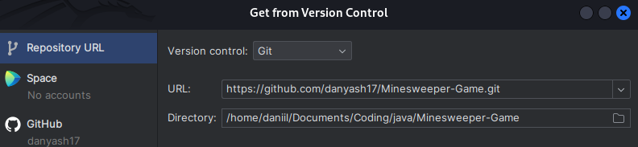
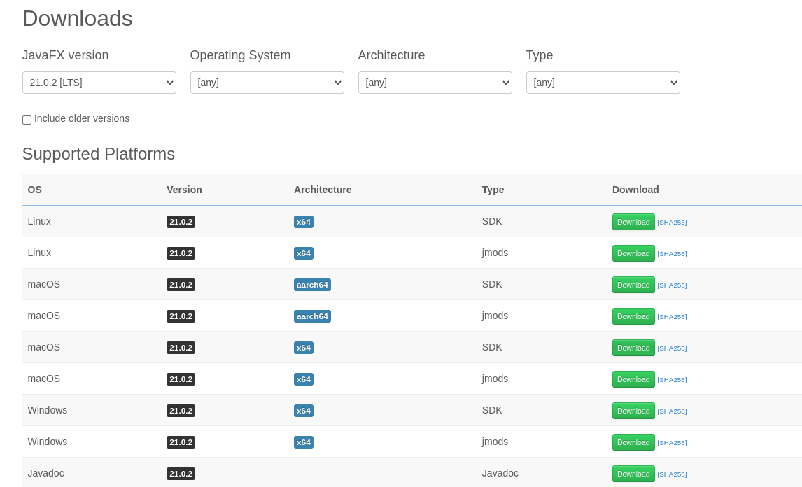
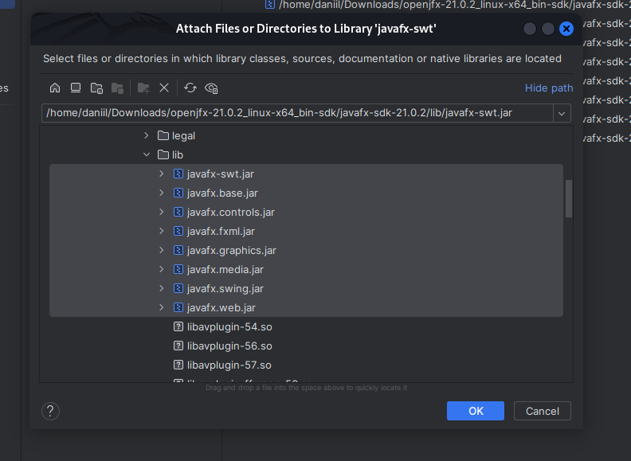
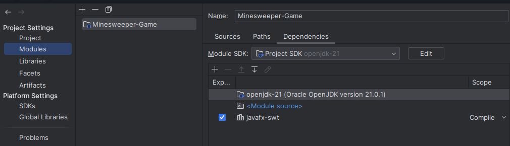
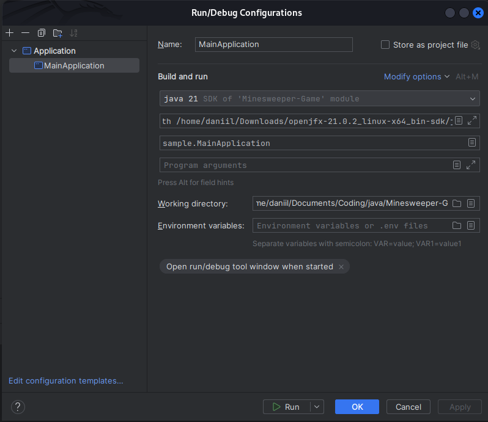
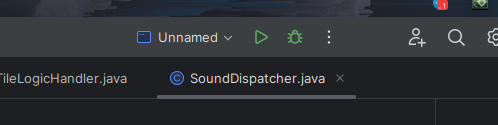

# Image Processor

JavaFX tool for image manipulation. Special thanks to @edisonwj for some basic image manipulation functionality.

## Authors

- @edisonwj](https://github.com/edisonwj) - basic JavaFX skeleton & image manipulation
- me - algorithms

## Functionality

An image file can be loaded for processing by using the Main Menu Open option.
Processed image files can be saved in various formats (bmp, jpg, png, gif) using
the Main Menu Save Image option.

The image scene can be:
  -  Rotated using Y axis (vertical) right click drag mouse movement
  -  Zoomed in or out using the keypad + or - keys or the mouse roller button
  -  Moved around in the display window using the up, down, left, or right arrow keys
  -  Reset to the default settings using the 'r' or 'R' key

Algorhythms:

- Upload/Save image files
- Image Inversion
- Adding/subtracting a constant to an image RGB representation
- Apply natural logarithm
- Power image pixels
- Create histograms:
	- For original image
	- For user-defined image
	- For equalised image
- Greying the image
- Linear contrast adjustment
- Bit Slicing - Layer Extraction
- Global thresholding
	- Otsu method
	- Histogram method
	- Gradient method

You could try using images from *samples* directory.

## Installation
    
To be honest - installation process is a little goofy. Back at the time I wasn't aware of how to do a portable and cross-platform application. If you're struggling with installation, contact me. There is a tutorial on how to boot using Intellij Idea:

First, install Intellij Idea IDE, if you don't have it. Start IDE and select "Get from VCS".


Paste current repo URL and click Clone.


Now you have a game in your computer. After that comes the goofy part - you need to manually import JavaFX SDK into project in order for it to work. I know, I know, I should've used Maven! :D

Anyway, go to https://gluonhq.com/products/javafx/ and download SDK for your operating system. I've tried using 21.0.2 and it worked.


Now get back to Intillij, select File->Project Structure->Libraries. Press + sign, find unpacked JavaFX SDK folder, open it, then open **lib** folder and select all .jar files.



Click OK and go to Modules. Select Dependencies at right section. Check **javafx-sft** if it's present. If not, leave it as it has.


And the last step. Close Project Structure, find **Current file** label, click, then click **Edit configurations**. Click **Add new configuration** Choose **Application**. Select or enter the main class - sample.MainApplication. Click **Modify options**, then click "Add VM options". At VM options field, paste the following string:

```bash
  ---module-path
   <path-to-javafx-sdk>/lib
   --add-modules
   javafx.swing,javafx.graphics,javafx.fxml,javafx.media,javafx.controls
```

Please make sure to paste YOUR path to JavaFX SDK instead of path-to-javafx-sdk. Save the configuration.



After that, you're finally ready to run. Just click that green sign at right top.


## Demo

